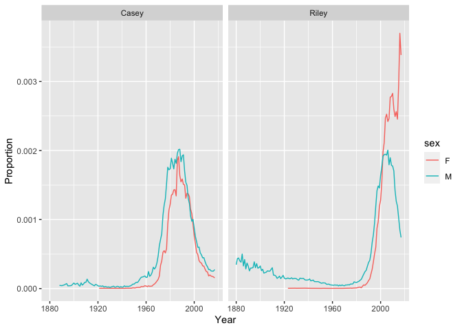

Popularity of Baby Names
================

    ## 
    ## Attaching package: 'dplyr'

    ## The following objects are masked from 'package:stats':
    ## 
    ##     filter, lag

    ## The following objects are masked from 'package:base':
    ## 
    ##     intersect, setdiff, setequal, union

To what extent have the names Casey and Riley been unisex names over
time?

<!-- -->
